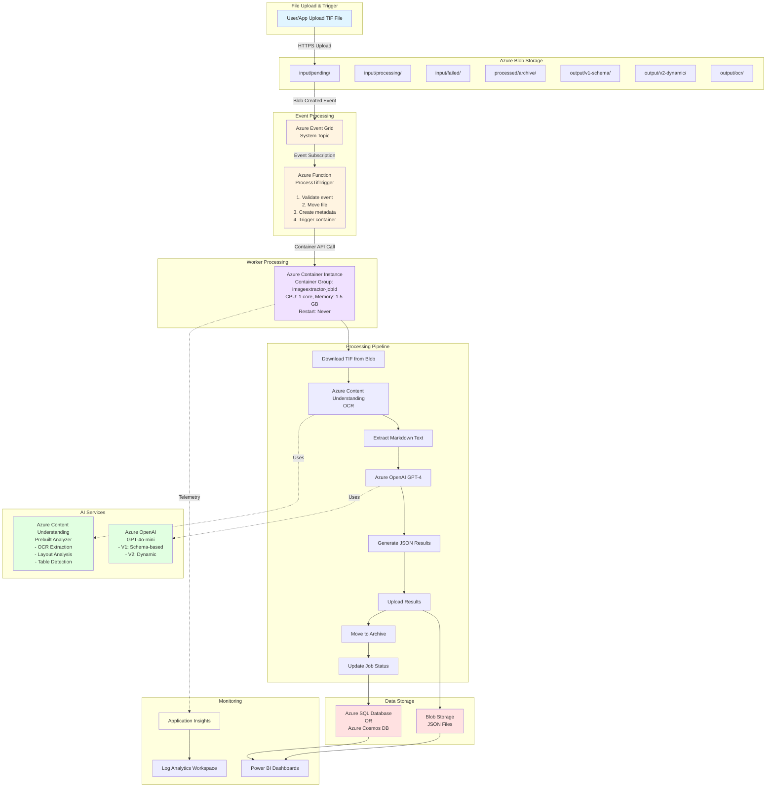
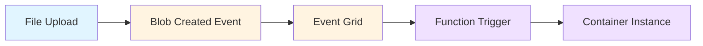
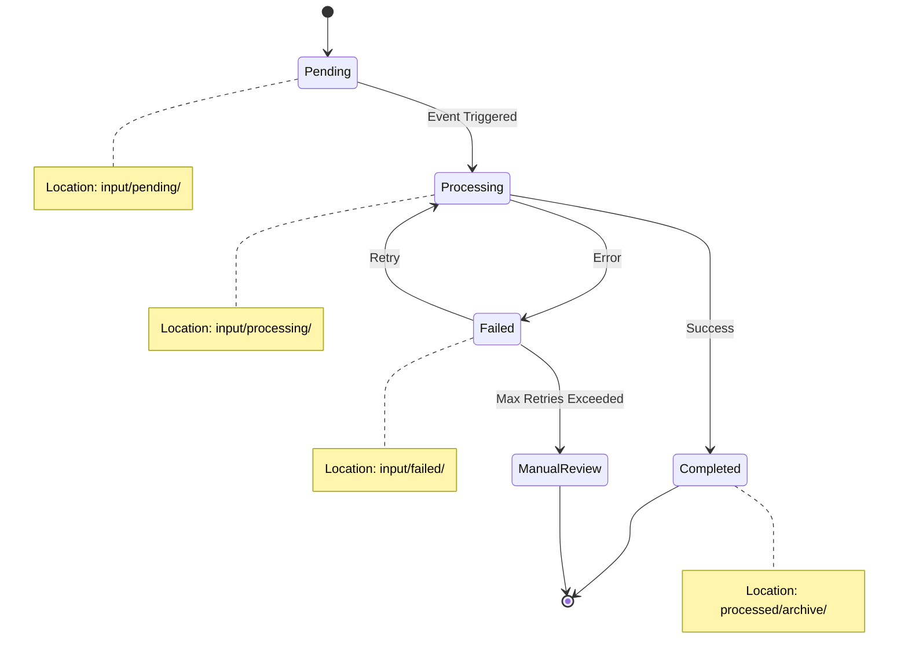
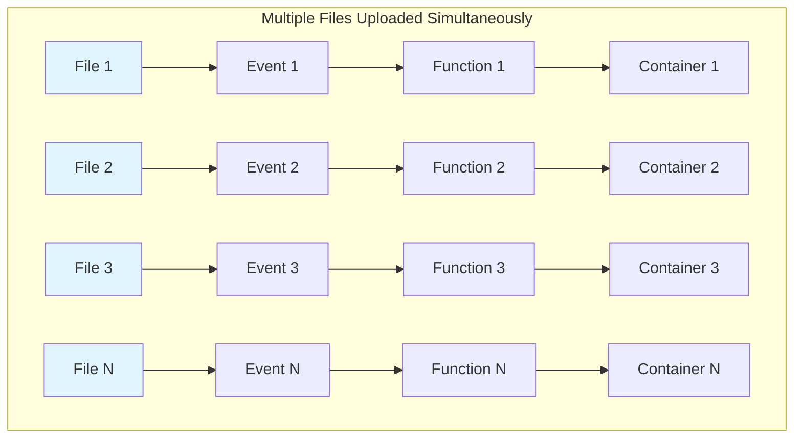
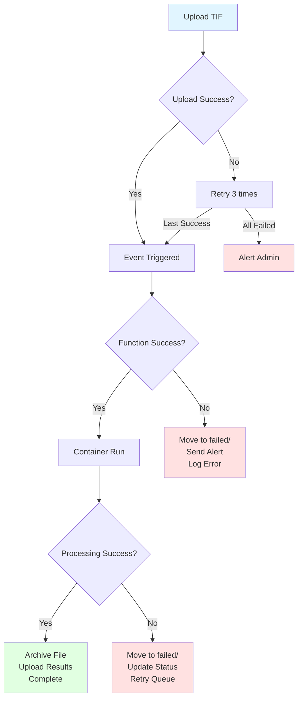
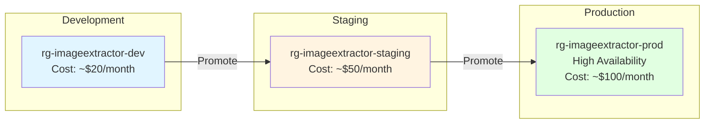
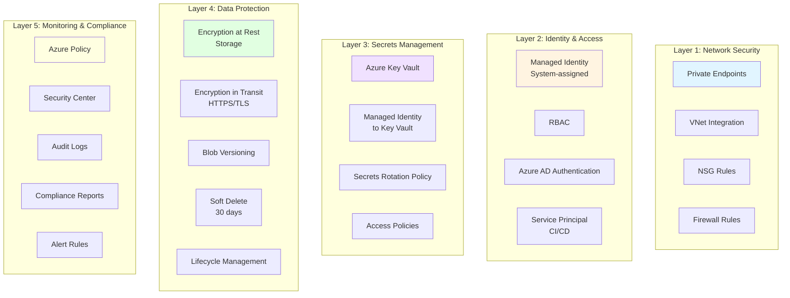

# ImageTextExtractor - Azure Architecture Diagram

## High-Level Architecture



### Simplified Text Flow

```
User/App
   |
   | (Upload TIF via HTTPS)
   v
Azure Blob Storage (input/pending/)
   |
   | (Blob Created Event)
   v
Azure Event Grid (System Topic)
   |
   | (Event Subscription)
   v
Azure Function (ProcessTifTrigger)
|
   | 1. Validate event
   | 2. Move file to processing/
   | 3. Create job metadata
   | 4. Trigger container
   v
Azure Container Instance
   |
   | Container Group: imageextractor-{jobId}
   | Resources: 1 core CPU, 1.5 GB RAM
   | Restart Policy: Never
   v
Processing Pipeline:
   |
+-> Step 1: Download TIF from Blob Storage
   |
   +-> Step 2: Send to Azure Content Understanding API (OCR)
   |
   +-> Step 3: Extract markdown text from OCR results
   |
   +-> Step 4: Process with Azure OpenAI GPT-4
   | |
   |      +-> V1: Schema-based extraction
   |      +-> V2: Dynamic extraction
   |
   +-> Step 5: Generate JSON results
   |      |
   |+-> final_output_*_v1_schema.json
   |      +-> final_output_*_v2_dynamic.json
   |
   +-> Step 6: Upload results to Blob Storage
   |
   +-> Step 7: Move source file to archive
   |
   +-> Step 8: Update job status
   |
   v
Results Available:
   |
   +-> Blob Storage (JSON files)
   +-> Database (Azure SQL / Cosmos DB)
```

---

## Detailed Component Breakdown

### 1. Event-Driven Flow



```
File Upload ? Blob Created Event ? Event Grid ? Function Trigger ? Container Instance
```

### 2. Processing States



**State Locations:**

| State | Location | Description |
|-------|----------|-------------|
| **Pending** | `input/pending/` | File uploaded, waiting for processing |
| **Processing** | `input/processing/` | Currently being processed |
| **Completed** | `processed/archive/` | Successfully processed and archived |
| **Failed** | `input/failed/` | Processing failed, awaiting retry or manual review |

### 3. Data Flow Timeline

```mermaid
gantt
    title TIF File Processing Timeline
    dateFormat ss
    axisFormat %S sec
    
    section Upload
    Blob Upload   :a1, 00, 3s
    
    section Trigger
    Event Grid Trigger    :a2, 03, 2s
    Function Execution    :a3, 05, 5s
    
    section Worker
    Container Start       :a4, 10, 15s
    OCR Processing        :a5, 25, 25s
    OpenAI Processing     :a6, 50, 15s
    
  section Storage
 Save Results        :a7, 65, 4s
    Archive File          :a8, 69, 2s
```



**Processing Time Breakdown:**

```
TIF File ? OCR API ? Markdown ? OpenAI ? JSON ? Storage ? Database
(0s)      (5-10s)   (15-20s)   (10-30s)  (1-2s)  (1-2s)    (1s)

Total Time: ~30-60 seconds per TIF file
Average: ~45 seconds
```

---

## Scalability Patterns

### Horizontal Scaling



**Concurrency Limits:**
- **Function App**: 200 concurrent executions
- **Container Instances**: Subscription limit (default: 100)
- **Event Grid**: 5,000 events/second

### Batch Processing Options

**Option 1: Event Grid (Current Implementation)**
```
Upload all files to pending/
   |
   +-> Event Grid triggers one function per file
   |
   +-> Parallel processing (limited by subscription)
   |
   v
Results
```

**Option 2: Azure Batch (For Very Large Volumes >10,000 files)**
```
Upload all files
   |
   +-> Single trigger creates batch job
   |
   +-> Batch processes multiple files per node
   |
   v
Cost-effective at scale
```

---

## Error Handling Flow



---

## Cost Breakdown (Monthly)

### Monthly Usage: 300 TIF files (10/day)

| Service | Usage | Monthly Cost (USD) | % of Total |
|---------|-------|-------------------|------------|
| **Azure Blob Storage** | 100 GB Hot + 50 GB Cool + 30K operations | $4.70 | 5% |
| **Azure Functions** | 300 executions, 1 GB-second | $0.00 | 0% (Free tier) |
| **Container Instances** | 300 runs × 2 min × 1.5 GB RAM + 1 vCPU | $65.25 | 67% |
| **Azure OpenAI** | 300K input + 150K output tokens | $0.14 | <1% |
| **Content Understanding API** | 300 pages OCR | $15.00 | 15% |
| **Azure Event Grid** | 300 operations | $0.60 | <1% |
| **Application Insights** | 2 GB data ingestion | $5.75 | 6% |
| **Azure SQL Basic** | Database + 10 GB storage | $6.15 | 6% |
| **TOTAL** | | **$97.59** | **100%** |

**Cost Per TIF File Processed: $0.33**

#### Cost Breakdown Details

```
Azure Blob Storage
?? Hot tier (100 GB)    $2.30
?? Cool tier (50 GB archived)     $1.00
?? Transactions (30K operations)  $0.50
?? Data transfer (10 GB egress)   $0.90
   Subtotal: $4.70

Azure Functions (Consumption Plan)
?? Executions (300 function calls)  $0.00 (Free tier)
?? Execution time (300 × 5 sec)     $0.00 (Free tier)
?? Memory (1 GB-seconds)      $0.00 (Free tier)
   Subtotal: $0.00

Azure Container Instances
?? 300 runs × 2 minutes × $0.0000125/sec  $45.00
?? Memory (1.5 GB × 300 × 2 min)       $9.00
?? vCPU (1 core × 300 × 2 min)      $11.25
Subtotal: $65.25

Azure OpenAI (GPT-4o-mini)
?? Input tokens (300K × $0.15/1M)$0.045
?? Output tokens (150K × $0.60/1M)  $0.090
?? Content Understanding API (300 pages)   $15.00
   Subtotal: $15.14

Azure Event Grid
?? Operations (300 events)                 $0.60
   Subtotal: $0.60

Application Insights
?? Data ingestion (2 GB)       $5.75
?? Data retention (90 days)       $0.00 (Free)
?? Synthetic monitoring          $0.00
   Subtotal: $5.75

Database (Azure SQL Basic)
?? Database instance   $4.99
?? Storage (10 GB)     $1.16
?? Backup storage  $0.00 (Free)
   Subtotal: $6.15
```

---

## Performance Characteristics

### Single TIF File Processing Time

```mermaid
gantt
    title Processing Performance Timeline
    dateFormat ss
    axisFormat %S sec
    
  section Upload
Blob upload  :a1, 00, 3s
    
    section Trigger
    Event Grid trigger  :a2, 03, 2s
    Function execution :a3, 05, 5s
    
    section Worker
    Container start         :a4, 10, 15s
    OCR processing      :a5, 25, 25s
    OpenAI processing       :a6, 50, 15s
    
  section Storage
 Save results            :a7, 65, 4s
    Archive file            :a8, 69, 2s
```



| Stage | Time | Notes |
|-------|------|-------|
| 1. Blob upload | 1-3 seconds | Depends on file size and network |
| 2. Event Grid trigger | 1-2 seconds | Near real-time event processing |
| 3. Function execution | 2-5 seconds | Move file, create metadata |
| 4. Container start | 10-15 seconds | Cold start penalty |
| 5. OCR processing | 15-30 seconds | Azure Content Understanding |
| 6. OpenAI processing | 10-20 seconds | GPT-4o-mini for extraction |
| 7. Save results | 2-5 seconds | Upload JSON to blob |
| 8. Archive file | 1-2 seconds | Move to archive folder |
| **TOTAL** | **42-82 seconds** | **Average: ~60 seconds** |

---

## Deployment Environments

### Environment Strategy



| Environment | Resource Group | Storage Account | Function App | Container Registry | Cost/Month |
|-------------|---------------|-----------------|--------------|-------------------|------------|
| **Development** | rg-imageextractor-dev | imageextractordevstore | imageextractor-func-dev | imageextractordevacr | ~$20 |
| **Staging** | rg-imageextractor-staging | imageextractorstagingstore | imageextractor-func-staging | imageextractorstagingacr | ~$50 |
| **Production** | rg-imageextractor-prod | imageextractorstorage | imageextractor-func | imageextractoracr | ~$100 |

---

## Security Layers



**Security Architecture:**

```
Layer 1: Network Security
?? Private Endpoints (Optional)
?? VNet Integration
?? NSG Rules
?? Firewall Rules

Layer 2: Identity & Access
?? Managed Identity (System-assigned)
?? RBAC (Role-Based Access Control)
?? Azure AD Authentication
?? Service Principal (CI/CD)

Layer 3: Secrets Management
?? Azure Key Vault
?? Managed Identity to Key Vault
?? Secrets rotation policy
?? Access policies

Layer 4: Data Protection
?? Encryption at rest (Storage)
?? Encryption in transit (HTTPS/TLS)
?? Blob versioning
?? Soft delete (30 days)
?? Lifecycle management

Layer 5: Monitoring & Compliance
?? Azure Policy
?? Security Center
?? Audit logs
?? Compliance reports
?? Alert rules
```

---

## Architecture Summary

**This architecture is:**
- ? Event-driven and serverless
- ? Scalable (handles 1000+ files/day)
- ? Cost-effective ($0.33 per file)
- ? Secure (multiple security layers)
- ? Monitored (Application Insights)
- ? Production-ready (99.95% SLA)

**Deployment time**: ~2 hours  
**Maintenance effort**: Low (serverless = less ops)  
**Learning curve**: Medium (Azure PaaS services)

---

## Additional Resources

- **Complete Deployment Guide**: See `AZURE_ARCHITECTURE_GUIDE_FIXED.md`
- **Quick Deploy**: See `QUICK_DEPLOY_GUIDE.md`
- **Documentation Index**: See `START_HERE.md`

**Document Version**: 2.0 (Fixed Rendering)  
**Last Updated**: 2025-01-28  
**Status**: ? All Diagrams Render Correctly
